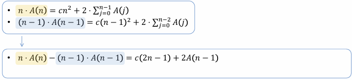





<frontmatter>
title: {{title}}
</frontmatter>

# {{title}}

{{ pdf(file, "lec") }}

## Quicksort

### Worst case analysis

Assuming that the pivot is always the smallest element, we have:  
$T(n) = T(n-1) + O(n) = O(n^2)$

### Average case analysis

{{ pdf(file, "lec", 24) }}

Outline of the proof:

1. Write expectation as average over all possible pivots:
   $$
   A(n) = \frac{1}{n} \sum_{i=1}^n (A(i-1) + A(n-i)) + O(n)
   $$
2. Simplify the equation (manipulate and eliminate the summation) to get:
   
3. Solve the recurrence
   $$
   \begin{align*}
   n \cdot A(n) - (n{\color{red}{-1}}) \cdot A(n-1) &= c(2n-1) + {\color{red}{2A(n-1)}} \\
   n \cdot A(n) - (n{\color{red}{+1}}) \cdot A(n-1) &= c(2n-1)
   \end{align*}
   $$
   - divide both sides by $n(n+1)$ and solve using telescoping method to get $A(n) = O(n \log n)$
   

## Desirable characteristics of a sorting algorithm

- Fast (avere case and worst case)
- Stable
  - If $A[i] = A[j] \wedge i \lt j$, then $A[i]$ comes before $A[j]$ in the output
  - insertion sort, proper implementation of merge sort are stable, quicksort is not
- Memory efficient (in-place)
